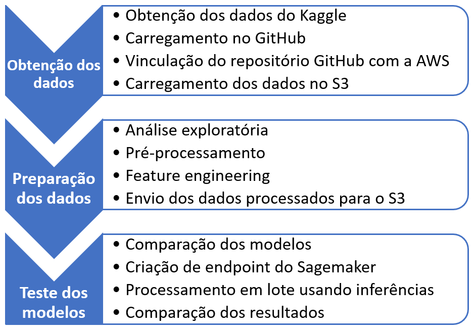
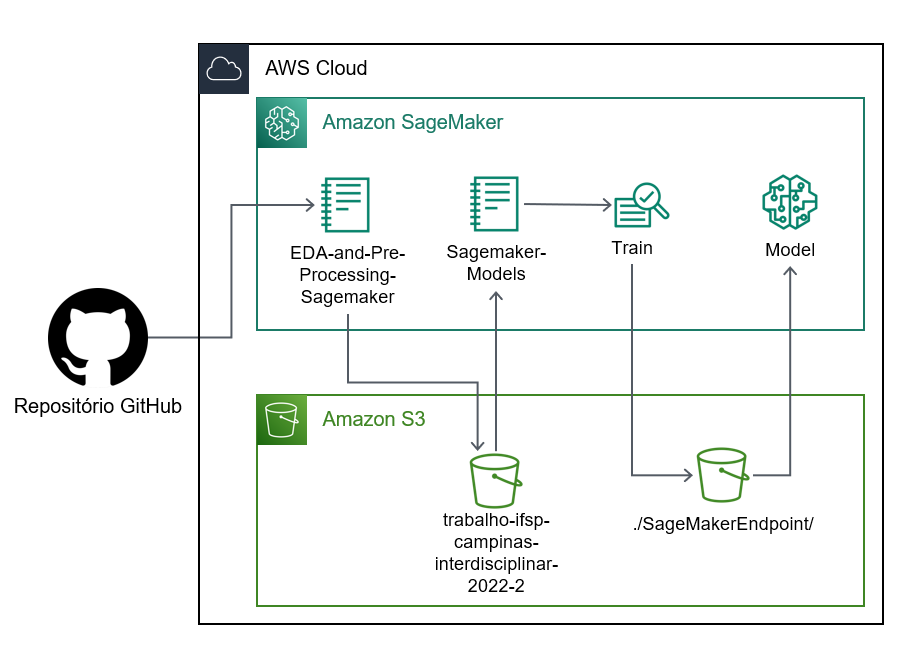
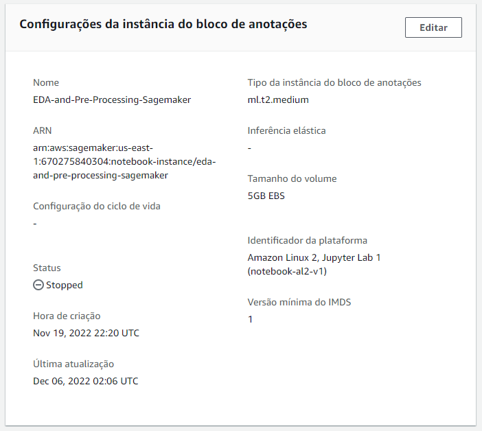
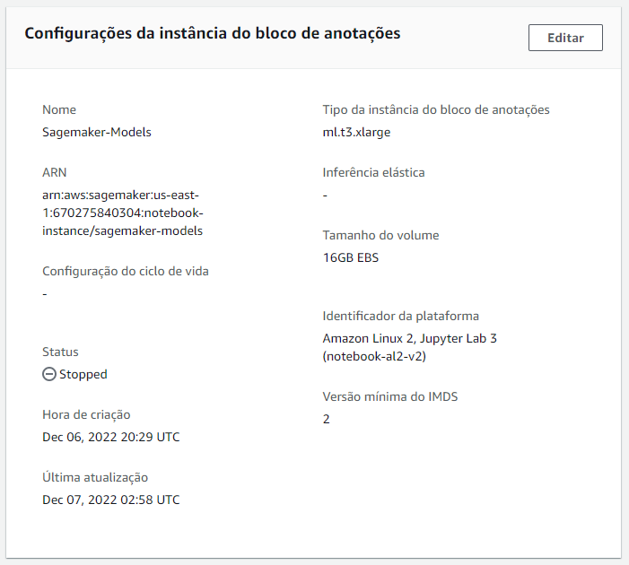
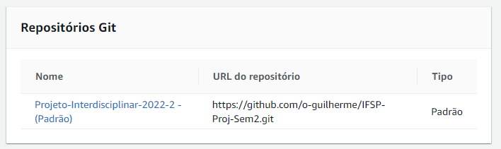

# Trabalho Interdisciplinar do IFSP - Câmpus Campinas | 2.º Semestre

## Análise de leads de plano de saúde
---

Alunos: 
Guilherme - CP301620X 
Mariana	- CP3016625
        
---

# 1 Introdução

Esse é o projeto interdisciplinar do 2.º Semestre da Pós-Graduação *Lato Sensu* de Especialização em Ciência de Dados do Instituto Federal de São Paulo, Câmpus Campinas.

O trabalho tem como principal objetivo exercitar e aplicar as técnicas e ferramentas aprendidas ao longo do curso em um problema concreto.

Nesse caso, foi utilizado um dataset público do site de uma seguradora de saúde que oferece planos às pessoas que visitam a página.

No referido dataset foi realizada análise exploratória e e treinamento de modelos, sendo também realizado um deploy na Amazon Web Services (AWS), junto com a criação de um endpoint para inferências *on-demand*, bem como processamento em lote.

## 1.1 Descrição do problema

Determinada operadora de plano de saúde possui um site em que, após serem obtidos alguns dados do visitante, é oferecido um plano de saúde ao visitante. Se esse visitante preenche o formulário do contrato ele se torna um *lead*, isso é, uma pessoa que demonstrou interesse no produto.

Leads são importantes para a venda e o marketing pois traduzem a quantidade de pessoas efetivamente interessadas no produto que são um melhor alvo à equipe de vendas para eventualmente concluir o negócio.

No dataset são apresentados vários dados capturados pela operadora referente ao possível cliente que podem ser mais ou menos relevantes para que a pessoa preencha o formulário e se qualifique como lead.

Sendo assim, o problema consiste em formular um modelo que realize a classificação dos dados e elabore predições baseadas nos dados disponíveis.

## 1.2 Objetivo

Embora se trate de um dataset com relevância econômica, o objetivo na atividade foi essencialmente aplicar os métodos aprendidos ao longo do semestre, notadamente os algoritmos de classificação, pipeline e processamento de dados, bem como realizar o deploy nas estruturas da AWS.

A métrica escolhida para o treinamento para os modelos foi a acurácia, pois se preza pela maior quantidade de acertos referentes às características dos visitantes, sendo menos importante minimizar falsos positivos ou falsos negativos.

Em uma aplicação prática, o valor do modelo, conforme concluído ao final pela árvore de decisão, serve como subsídio à discussão dos principais fatores relevantes para o visitante se tornar um lead.

# 2 Dados 

## 2.1 Origem dos dados

Os dados estão disponíveis publicamente na plataforma Kaggle, no seguinte endereço: 
www.kaggle.com/datasets/owaiskhan9654/health-insurance-lead-prediction-raw-data

## 2.2 Descrição dos dados

Os dados são tabulares e consistem num arquivo CSV, contendo 50882 linhas, as quais trazem 14 colunas, cada uma representando uma variável.

Essas colunas são divididas da seguinte maneira:

| Coluna | Definição |
| --- | --- |
| ID Unique | Identificador da coluna |
| City_Code | Código da cidade dos clientes |
| Region_Code | Código da região dos clientes |
| Accomodation_Type | Se o cliente é dono ou não da casa |
| Reco_Insurance_Type | Tipo de seguro recomendado, individual ou em conjunto |
| Upper_Age | Idade máxima do cliente | 
| Lower_Age | Idade mínima do cliente | 
| Is_Spouse | Se os segurados são casados, no caso de conta conjunta | 
| Health_Indicator | Indicadores de saúde do cliente | 
| Holding_Policy_Duration | Duração em anos do seguro, se o cliente já era segurado da compania | 
| Holding_Policy_Type | Tipo do seguro, se o cliente já era segurado | 
| Reco_Policy_Cat | Tipo de seguro recomandado para o cliente | 
| Reco_Policy_Premium Annual | Prêmio recomendado para o cliente | 
| Response | Se o cliente solicitou ou não o plano de saúde, variável alvo | 

Não há mais informaçõe sobre os dados além das disponíveis na página do Kaggle de onde foi obtido o dataset.

Como um dos objetivos do trabalho era explorar formas de transformação dos dados e fazer comparações entre eles e os modelos, na etapa de análise exploratória e pré-processamento foram criados vários datasets derivados para serem passados aos modelos e realizar a comparação dos resultados.

Referidos passos estão descritos no [notebook da análise exploratória e pré-processamento](./SageMaker_Analise_Exploratoria_e_Pre-processamento.ipynb).

# 3 Organização da solução

## 3.1 Processo de implementação

A implementação da solução foi feita seguindo esses passos:

## 3.2 Deploy da estrutura na AWS

Para implementar os passos acima, foram utilizados os recursos da AWS seguindo o seguinte *workflow*:

O processo pode ser resumido assim:
* Dados do Kaggle foram carregados no repositório do GitHub;
* A instância '*EDA-and-Pre-Processing-Sagemaker*' foi utilizada para rodar o arquivo '*SageMaker_Analise_Exploratoria_e_Pre-processamento.ipynb*';
* Referida instância carrega os dados brutos armazenados no GitHub e os armazena no bucket designado para o projeto, qual seja, '*trabalho-ifsp-campinas-interdisciplinar-2022-2*';
* O notebook também gera outras cópias transformadas que são armazenadas no mesmo bucket;
* Essa instância é encerrada e incia-se a outra instância do Sagemaker, a '*Sagemaker-Models*', a qual roda o arquivo '*SageMaker_Treinamento_dos_modelos.ipynb*';
* Esse notebook treina vários modelos e os compara;
* Esse notebook também treina o modelo XGBoost hospedado na AWS;
* Em sequência, é criado o endpoint do SageMaker, com os dados armazenado no diretório do bucket;
* Esses dados armazenados são chamados para o modelo realizar as predições.

Como se observa, foram criados dois jupyter notebooks para realizar as atividades.

A razão disso é que o notebook para análise exploratória, para diminuir o custo de uso, foi instanciado em máquina menor, usando o *ml.t2.medium*, com armazenamento na Elastic Block Store (EBS) de apenas 5GB, como se vê:

Já o segundo notebook, por realizar treinamento de modelos, foi instanciado na maior máquina disponível para o trabalho, qual seja, *ml.t3.xlarge*, com armazenamento maior de 16 GB na EBS, como se vê:

Ambos os notebooks são vinculados com o repositório do GitHub:

### Artefatos:

- [Arquivo de dados (Datasets)](https://github.com/o-guilherme/IFSP-Proj-Sem2/tree/main/datasets)
- Notebooks:
  - Análise exploratória e pré-processamento)
  - Treinamento do modelo e comparações
- Diagrama do deploy na AWS
- Apresentação

---
